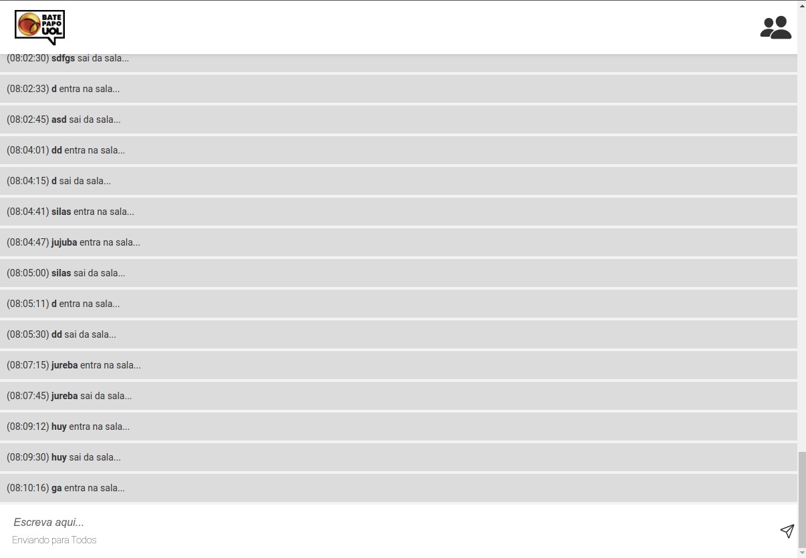

# batePapoUOL

### Projeto com JavaScript de implementação de um bate-papo totalmente funcional, inspirado no saudoso Bate-Papo UOL.

### Realizado por Gabriel Neves no Bootcamp Responde Aí

### Site disponivel em: https://neves-gabriel.github.io/batePapoUOL/

#### Previews do projeto:

